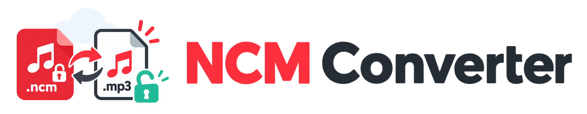

<h1 align="center"></h1>

[Use online](https://yazhuoliu.com/ncmconverter/) · [Source code](https://github.com/Yazhuo-Liu/ncmconverter) · **English** · [简体中文](README_zh.md)

[](https://github.com/Yazhuo-Liu/ncmconverter/actions/workflows/test.yml)

`ncmconvertor` restores NetEase Cloud Music NCM cache files to their original audio. This fork keeps the existing Rust CLI and libraries while adding a browser version that runs entirely on the user's device.

> [!IMPORTANT]
> Files are processed only inside the current browser tab. They are never uploaded to a server.

## Web app

The web app supports selecting or dropping multiple `.ncm` files. It calls the existing Rust/WASM decoding and metadata logic inside a module Web Worker, identifies the output from the decrypted audio data, and produces MP3, FLAC, M4A, or OGG files.

Each file has an independent status. Successful conversions can be previewed and downloaded with the correct extension and MIME type. The interface is available in Chinese and English.

- Web app: [yazhuoliu.com/ncmconverter](https://yazhuoliu.com/ncmconverter/)
- Source: [Yazhuo-Liu/ncmconverter](https://github.com/Yazhuo-Liu/ncmconverter)

The site contains no upload API, analytics, advertising, tracking SDK, remote font, or runtime CDN dependency. The deployment consists only of static files.

### Requirements

- Node.js 20.19 or newer
- The Rust toolchain selected by `rust-toolchain.toml`
- The `wasm32-unknown-unknown` Rust target
- wasm-pack 0.13.1

Install the Rust target and wasm-pack if they are not already available:

```bash
rustup target add wasm32-unknown-unknown
cargo install wasm-pack --version 0.13.1 --locked
```

### Local development

```bash
cd web
npm install
npm run dev
```

`npm run dev` builds the browser WASM package first and then starts the Vite development server.

### Production build

```bash
cd web
npm install
npm run build
```

The build command compiles Rust to browser WASM and then builds the frontend. Final static files are written to `web/dist/`. Assets use relative URLs so the site works under the `/ncmconverter/` GitHub Pages subpath.

Run the browser-WASM conversion checks against all NCM fixtures in the repository with:

```bash
npm run verify:wasm
```

### GitHub Pages deployment

[`.github/workflows/pages.yml`](.github/workflows/pages.yml) builds and deploys the web app whenever the default branch is updated. It installs the pinned Rust and wasm-pack versions, installs Node dependencies, builds the project, uploads `web/dist/`, and deploys it with the official GitHub Pages Actions.

Before the first deployment, open **Settings → Pages → Build and deployment** in the GitHub repository and set **Source** to **GitHub Actions**.

### Browser memory limits

Browser conversion may simultaneously hold the encrypted input, WASM linear memory, decrypted output, and a Blob used for preview and download. Peak memory use can therefore be several times the input file size.

Files are converted serially. The interface warns about files larger than 100 MiB but does not impose an arbitrary size limit. The practical limit depends on the browser, operating system, and available device memory. Select fewer files at once on memory-constrained or mobile devices.

## CLI

The project name is `ncmconvertor`. The existing executable and Rust crate remain named `ncmc` for command-line compatibility.

Install the CLI from this repository:

```bash
cargo install --path crates/ncmc
```

Or run it directly from the repository root:

```bash
cargo run -p ncmc -- path/to/your/file.ncm
```

Install Rust using [rustup](https://rustup.rs/) if it is not already available.

### CLI usage

```bash
# Convert one file
ncmc path/to/your/file.ncm

# Scan only the top level of a directory (.ncm and .NCM files)
ncmc path/to/music-directory

# Recursively scan directories; direct file inputs can be mixed in
ncmc --recursive path/to/music-directory another/file.ncm

# Do not overwrite audio files that already exist
ncmc --recursive --skip-existing path/to/music-directory

# Dump the decrypted key, metadata, cover, and audio data
ncmc --dump path/to/your/file.ncm
```

Directory scans select only NCM files, use ASCII case-insensitive extension matching, and do not follow symlinks discovered inside a directory. Direct file inputs are not extension-filtered.

Conversions run serially. A failed file is reported while the remaining files continue. Each run ends with a `total`, `succeeded`, `skipped`, and `failed` summary. Discovery or conversion failures cause a non-zero exit status.

## Acknowledgements and license

`ncmconvertor` is a fork of [ghostroller/ncmc](https://github.com/ghostroller/ncmc) and retains its Rust CLI and library functionality.

The upstream project credits [anonymous5l/ncmdump](https://github.com/anonymous5l/ncmdump).

This project is released under the [MIT License](LICENSE). Attribution for the upstream project and its contributors remains available in the original repository history.
